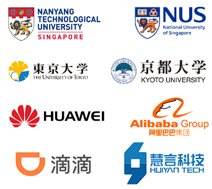

## About Me {#about}
<strong style="color:red">目前正在招收2027届硕士研究生，常年招收博士研究生，对语音语言处理、大模型、声学信号处理、深度学习等感兴趣的同学请联系我。</strong>

<strong style="color:red">诚聘海内外英才，欢迎在语音、语言、声学及相关领域有良好基础的青年才俊联系我，天津市天津大学认知计算与应用重点实验室期待您的加入！</strong>

国家级青年人才

天津市认知计算与应用重点实验室主任

天津大学人工智能学院 教授、博导/硕导

日本北陆先端科学技术大学院大学 客座教授

2008年3月毕业日本国立丰桥技术科学大学，获博士学位。2008年4月到2016年8月任日本国立静冈大学助理教授、日本国立长冈技术科学大学副教授。2016年9月至今任天津大学智能与计算学部英才教授、菁英教授，天津市认知计算与应用重点实验室主任，入选国家级海外高层次青年人才，目前担任 APSIPA Speech and Language Processing Technical Committee 副主席（Vice Chair），曾任 ISSP 2017 技术委员会主席、Interspeech 2020 Satellite Workshop SLIMTS 大会主席 、首届 APSIPA China-Japan Joint Symposium on Speech and Language Processing (2024)大会主席；长期从事语音交互、声学信号处理、自然语言处理、机器学习、人工智能等方向的研究，承担/曾承担科技部重点研发项目、国家自然科学基金委面上项目、联合重点项目，以及其他省部级、企业横向课题近 20 项，相关成果被应用到二十余家龙头企业，产生的经济效益超过3亿元。 “面向复杂交互时变场景的对抗语音处理和语义计算关键技术及应用”获得天津市科技进步一等奖；在 IEEE/ACM TASLP、 IEEE TNNLS、 IEEE TCYB、 IEEE TAFFC、IEEE TKDE、IEEE TCSVT、IEEE JSTSP 等国际一流期刊以及在 NIPS、ACL、AAAI、IJCAI、 EMNLP、 ACMMM、 ICASSP、 Interspeech 等国际一流会议上共发表了超过200 篇学术论文。

<h3 style="color:#1f4e79; margin-bottom:10px;">Teaching</h3>

<ul class="teaching-list">
    <li><strong>《语音信息处理》</strong> 本科生</li>
    <li><strong>《语音与语言理解综合实践》</strong> 本科生</li>
    <li><strong>《人工智能导论》</strong> 本科生</li>
    <li><strong>《语音信号处理》</strong> 研究生</li>
</ul>

<h3 style="color:#1f4e79; margin-top:30px;">Representative Collaborators</h3>

    

## Latest News {#latest}

<ol>
  <li><strong>2026.06：</strong>恭喜实验室七篇论文被语音处理顶会 InterSpeech 2026 录用。</li>

  <li><strong>2026.05：</strong>恭喜魏燚伟同学顺利通过博士答辩，并受聘于中国石油大学（克拉玛依校区）。</li>

  <li><strong>2026.05：</strong>恭喜赵佳慧、崔中健、林程涵、庄凝、李津、王浩宇、努尔艾力·阿力甫、顾铭扬同学顺利通过硕士答辩。</li>

  <li><strong>2026.04：</strong>恭喜王天锐同学的论文 “Evaluating the Expressive Appropriateness of Speech in Rich Contexts” 和强春雨同学的论文 “UniSonate: A Unified Model for Speech, Music, and Sound Effect Generation with Text Instructions” 入选 ACL 2026 <em>Best Paper Candidate</em>。</li>

  <li><strong>2026.04：</strong>恭喜魏笑、林羽钦、刘吉、强春雨、林程涵等同学的论文分别被国际声学、语音与信号处理会议 ICASSP 2026 录用。</li>

  <li><strong>2026.03：</strong>恭喜魏燚伟同学的论文 “Mining the Potential of LVLMs in Multimodal Sentiment Detection through Cross-modality Pre-alignment” 发表于 <em>Expert Systems with Applications</em>。</li>

  <li><strong>2026.02：</strong>恭喜韩仁达同学等的论文 “A Unified Graph Clustering Network” 发表于 WWW 2026。</li>

  <li><strong>2025.12：</strong>恭喜王天锐同学等的论文 “Word-Level Emotional Expression Control in Zero-Shot Text-to-Speech Synthesis” 发表于 NeurIPS 2025，并入选 Spotlight 论文。</li>
</ol>

## Experience {#experience}

- **2008.04-2012.09** Assistant Professor , Department of Systems Engineering, Shizuoka University, Japan
- **2012.10-2016.08** Associate Professor , Department of Electrical Engineering, Nagaoka University of Technology, Japan
- **2016.09-present** Professor, School of Computer Science and Technology, Tianjin University, China
- **2017.04-present** Visiting Professor, Japan Advanced Institute of Science and Technology

## Education {#education}

- **2003.04-2005.03** M.E., Spoken Language Processing Laboratory, Department of Information and Computer Sciences, Toyohashi University of Technology, Japan
- **2005.04-2008.03** Ph.D., Spoken Language Processing Laboratory, Department of Information and Computer Sciences, Toyohashi University of Technology, Japan

<!-- ## Awards {#awards}
- **2021 Global Top 100 Chinese Rising Stars in Artificial Intelligence** 
- **The 10th China National Conference on Social Media Processing (SMP), best paper award, 2022**
- **Excellent PhD graduate of Tianjin University, 2022**
- **Excellent PhD Thesis of Tianjin University, 2022** -->

## Publications {#publications}
<strong style="color:red">Journals（期刊）</strong>
<ol>
<li>Yiwei Wei, Zhengliang Guo, Haitao Shi, Chengyin Hu, Wei Liu, Jingjing Cao, Longbiao Wang. Mining the Potential of LVLMs in Multimodal Sentiment Detection through Cross-modality Pre-alignment. Expert Systems with Applications, Vol. 331, 133145, 2026.</li>
    <li>T. Wang et al., "Characteristic-Specific Partial Fine-Tuning for Efficient Emotion and Speaker Adaptation in Codec Language Text-to-Speech Models", submitted to Speech Communication.</li>
    <li>Junyu Wang, et al., Longbiao Wang. LORT: Locally Refined Convolution and Taylor Transformer for Monaural Speech Enhancement. Speech Communication, Vol. 175, 103314, 2025. DOI: 10.1016/j.specom.2025.103314.</li>
    <li>Linjuan Zhang, Baoning Niu, Kong Aik Lee, Longbiao Wang,"Make full use of your data: On copy-based augmentation in speech anti-spoofing,"Neurocomputing,Vol 649,2025, doi.org/10.1016/j.neucom.2025.130799.</li>
    <li>H. Wang, C. Qiang, T. Wang, C. Gong and L. Wang, "Emotional Style Transfer With Intensity Control in Zero-Shot TTS," in IEEE Signal Processing Letters, vol. 32, pp. 3137-3141, 2025, doi: 10.1109/LSP.2025.3592588.</li>
    <li>Yuqin Lin, Longbiao Wang, Jianwu Dang, Nobuaki Minematsu,"Gestural feature extraction and multi-feature co-activation for dysarthric speech recognition",Information Fusion,Vol 125,2026,103490, doi.org/10.1016/j.inffus.2025.103490.</li>
    <li>T. Wang et al., "Progressive Residual Extraction based Pre-training for Speech Representation Learning", submitted to IEEE/ACM TASLP (Accepted).</li>
    <li>Qiang, Chunyu and Geng, Wang and Zhao, Yi and Fu, Ruibo and Wang, Tao and Gong, Cheng and Wang, Tianrui and Liu, Qiuyu and Yi, Jiangyan and Wen, Zhengqi and Zhang, Chen and Che, Hao and Wang, Longbiao and Dang, Jianwu and Tao, Jianhua, "VQ-CTAP: Cross-Modal Fine-Grained Sequence Representation Learning for Speech Processing," in IEEE Transactions on Audio, Speech and Language Processing, vol. 33, pp. 1849-1861, 2025, doi: 10.1109/TASLPRO.2025.3564168.</li>
    <li>X Wang, Y Wang, D He, Z Yu, Y Li, L Wang, J Dang, D Jin, "Elevating Knowledge-Enhanced Entity and Relationship Understanding for Sarcasm Detection," in IEEE Transactions on Knowledge and Data Engineering, vol. 37, no. 6, pp. 3356-3371, June 2025, doi: 10.1109/TKDE.2025.3547055.</li>
    <li>Nan Li, Meng Ge, Longbiao Wang, Yang-Hao Zhou, Jianwu Dang, "HC-APNet: Harmonic Compensation Auditory Perception Network for low-complexity speech enhancement", Speech Communication, Volume 167, 2025, 103161, ISSN 0167-6393, https://doi.org/10.1016/j.specom.2024.103161.</li>
    <li>Nan Li, Longbiao Wang, Qiquan Zhang, Jianwu Dang, "Dual-stream Noise and Speech Information Perception based Speech Enhancement", Expert Systems with Applications, Volume 261, 2025, 125432, ISSN 0957-4174, https://doi.org/10.1016/j.eswa.2024.125432.</li>
    <li>Yiwei Wei, Maomao Duan, Hengyang Zhou, Zhiyang Jia, Zengwei Gao, Longbiao Wang* "Towards Multimodal Sarcasm Detection via Label-aware Graph Contrastive Learning with Back-translation Augmentation" Knowledge-Based Systems (KBS)</li>
    <li>Zhongjie Li , Gaoyan Zhang *, Shogo Okada , Longbiao Wang  , Bin Zhao , Jianwu Dang "MBCFNet: A Multimodal Brain-Computer Fusion Network for human intention recognition" Knowledge-Based Systems (KBS)</li>
    <li>Xiao Wei; Yuhang Li; Yuke Si; Longbiao Wang*; Xiaobao Wang; Jianwu Dang  "A Prompt-Based Hierarchical Pipeline for Cross-Domain Slot Filling" in IEEE/ACM Transactions on Audio, Speech, and Language Processing</li>
    <li>Wei, Yiwei*, Shaozu Yuan, Meng Chen, Xin Shen, Longbiao Wang, Lei Shen and Zhiling Yan. "MPP-net: Multi-perspective perception network for dense video captioning". Neurocomputing 552 (2023): 126523.</li>
    <li>Y. Lin, L. Wang*, Y. Yang and J. Dang*, "CFDRN: A Cognition-Inspired Feature Decomposition and Recombination Network for Dysarthric Speech Recognition," in IEEE/ACM Transactions on Audio, Speech, and Language Processing, vol. 31, pp. 3824-3836</li>
    <li>Yuqin Lin, Jianwu Dang, Longbiao Wang*, Sheng Li, Chenchen Ding. "Disordered speech recognition considering low resources and abnormal articulation", Proc. of Speech Communication. </li>
    <li>LI, Nan and Wang, Longbiao* and Ge, Meng* and Unoki, Masashi and Li, Sheng and Dang, Jianwu. "Robust Voice Activity Detection Using an Auditory-Inspired Masked Modulation Encoder Based Convolutional Attention Network", Proc. of Speech Communication. </li>
    <li>Y. Gao, L. Wang*, J. Liu, J. Dang and S. Okada, "Adversarial Domain Generalized Transformer for Cross-Corpus Speech Emotion Recognition", Proc. of TAFFC:1-12.</li>
    <li>Yuchun Shu, Haoneng Luo, Shiliang Zhang, Longbiao Wang*, Jianwu Dang, "A CIF-Based Speech Segmentation Method for Streaming E2E ASR",  IEEE Signal Processing Letters, 2023, 30: 344-348.</li>
    <li>Lin, Y., Zhang, S., Gao, Z., Wang, L., Yang, Y. and Dang, J. (2023), "Wav2vec-MoE: An unsupervised pre-training and adaptation method for multi-accent ASR." Electron. Lett., 59: e12823. https://doi.org/10.1049/ell2.12823</li>
    <li>Zhongjie Li, Gaoyan Zhang*, Longbiao Wang, Jianguo Wei and Jianwu Dang*. "Emotion recognition using spatial-temporal EEG features through convolutional graph attention network". Journal of Neural Engineering, 2023, 20(1).( DOI 10.1088/1741-2552/acb79e).</li>
    <li>Hanyi Zhang, Longbiao Wang*, Kong Aik Lee*, Meng Liu, Jianwu Dang, Helen Meng, "Meta-Generalization for Domain-Invariant Speaker Verification," in  IEEE/ACM Transactions on Audio, Speech, and Language Processing, vol. 31, pp. 1024-1036, 2023, doi: 10.1109/TASLP.2023.3244518.</li>
    <li>Siqing Qin, Longbiao Wang*, Sheng Li*, Jianwu Dang, Lixin Pan, "Improving Low-resource Tibetan End-to-end ASR by Multilingual and Multilevel Unit Modeling", EURASIP Journal on Audio, Speech, and Music Processing, 2022 (SCI三区) . 2022,2022(1).(DOI10.1186/s13636-021-00233-4).</li>
    <li>Lili Guo, Longbiao Wang*, Jianwu Dang*, Yahui Fu, and Jiaxing Liu, "Emotion Recognition with Multimodal Transformer Fusion Framework Based on Acoustic and Lexical Information", in IEEE MultiMedia,2022,28(2):94-103.(doi: 10.1109/MMUL.2022.3161411).</li>
    <li>Yahui Fu, Shogo Okada*, Longbiao Wang*, Lili Guo, Yaodong Song, Jiaxing Liu and Jianwu Dang*, "Context and Knowledge-Aware Graph Convolutional Network for Multimodal Emotion Recognition",IEEE MultiMedia, 2022, 29(3): 91-99. doi: 10.1109/MMUL.2022.3173430.</li>
    <li>Jaxing Liu, Longbiao Wang*, Zhilei Liu, Yaodong Song, Lili Guo and Jianwu Dang, "Representation learning with emotional latent information for speech emotion recognition", submitted to IEEE/ACM Transactions on Audio Speech and Language Processing</li>
    <li>Lili Guo, Longbiao Wang*, Jianwu Dang*, Eng Siong Chng, and Seiichi Nakagawad,"Learning affective representations based on magnitude and dynamic relative phase information for speech emotion recognition"[J]. Speech Communication, 2022, 136: 118-127.</li>
    <li>Q. Yu*, Y. Yao, L. Wang*, H. Tang, J. Dang, K. Tan, "Robust Environmental Sound Recognition with Sparse Key-point Encoding and Efficient Multi-spike Learning", IEEE Transactions on Neural Networks and Learning Systems (IF = 11.7; Accepted).</li>
    <li>Q. Yu*, S. Li, H. Tang, L. Wang, J. Dang, K. Tan, "Towards Efficient Processing and Learning with Spikes: New Approaches for Multi-Spike Learning", IEEE Transactions on Cybernetics (IF = 10.4; Accepted):2020.PP(99):1-13</li>
    <li>Meng Liu, Longbiao Wang*, Jianwu Dang, Kong Aik Lee, Seiichi Nakagawa, "Replay attack detection using variable-frequency resolution phase and magnitude features", Computer Speech &amp; Language, Volume 66,2021,101161.</li>
    <li>K. Phapatanaburi, Kasidit kokkhunthod, L. Wang et al., "Brainwave Classification for Character-Writing Application Using EMD-Based GMM and KELM Approaches", Computers, Materials &amp; Continua, vol.66, no.3, pp. 3029-3043, 2021 (DOI:10.32604/cmc.2021.014433)</li>
    <li>Chunlei Liu, Longbiao Wang, Jianwu Dang, "Deep Learning-Based Amplitude Fusion for Speech Dereverberation, Discrete Dynamics in Nature and Society", Discrete Dynamics in Nature and Society, 2020 (DOI:10.1155/ACCESS.2020.4618317)2020:PP.1-14</li>
    <li>L. Guo, L. Wang*, J. Dang, Z. Liu, H. Guan, "Exploration of Complementary Features for Speech Emotion Recognition Based on Kernel Extreme Learning Machine", IEEE Access, 2019 (IF=4.098) (DOI: 10.1109/ACCESS.2019.2921390)</li>
    <li>Z. Oo, L. Wang*, K. Phapatanaburi, M. Liu, S. Nakagawa, M. Iwahashi and J. Dang, "Replay attack detection with auditory filter-based relative phase features", EURASIP Journal on Audio, Speech, and Music Processing, 2019(1): 8, 2019 (IF=3.0)</li>
    <li>Z. Oo, L. Wang*, K. Phapatanaburi, S. Nakagawa, M. Iwahashi and J. Dang, "Phase and reverberation aware DNN for distant-talking speech enhancement", Multimedia Tools and Applications, 77(14): 18865-18880, 2018 (IF=1.5).</li>
    <li>L. Wang*, S. Nakagawa, Z. Zhang, Y. Yoshida and Y. Kawakami, "Spoofing Speech Detection Using Modified Relative Phase Information", IEEE J. Sel. Topics Signal Processing, 11(4): 660-670, 2017 (IF=6.8).</li>
    <li>K. Phapatanaburi, L. Wang*, Z. Oo, et al. "Noise robust voice activity detection using joint phase and magnitude based feature enhancement", Journal of Ambient Intelligence &amp; Humanized Computing, 8(9): 1-15, 2017 (IF=1.6).</li>
    <li>B. Ren, L. Wang*, L. Lu, Y. Ueda and A. Kai, "Combination of bottleneck feature extraction and dereverberation for distant-talking speech recognition", Multimedia Tools and Applications, 75(9): 5093-5108, 2016 (IF=1.5) (DOI: 10.1007/s11042-015-2849-1).</li>
    <li>K. Phapatanaburi, L. Wang*, R. Sakagami, Z. Zhang, X. Li and M. Iwahashi, "Distant-talking accent recognition by combining GMM and DNN", Multimedia Tools and Applications, 75(9): 5109-5124, 2016 (IF=1.5)(DOI: 10.1007/s11042-015-2935-4).</li>
    <li>Y. Ueda, L. Wang*, A. Kai, X. Xiao, E. Chng and H. Li, "Single-channel dereverberation for distant-talking speech recognition by combining denoising autoencoder and temporal structure normalization", Journal of Signal Processing Systems, 82(2): 151-161, 2016 (IF=0.9)(DOI: 10.1007/s11265-015-1007-3).</li>
    <li>Y. Ueda, L. Wang*, A. Kai and B. Ren, "Environment-dependent denoising autoencoder for distant-talking speech recognition", Eurasip Journal on Advances in Signal Processing, 2015(1): 1-11, 2015 (IF=2.0)(DOI: 10.1186/s13634-015-0278-y).</li>
    <li>Z. Zhang, L. Wang*, A. Kai, K. Odani, W. Li and M. Iwahashi, "Deep neural network-based bottleneck feature and denoising autoencoder-based dereverberation for distant-talking speaker identification", Eurasip Journal on Audio, Music and Speech Processing, 2015(1): 1-13, 2015 (IF=3.0)(DOI: 10.1186/s13636-015-0056-7).</li>
    <li>W. Li, L. Wang*, Y. Zhou, J. Dines, H. Bourlard and Q. Liao, "Feature Mapping of Multiple Beamformed Sources for Robust Overlapping Speech Recognition Using a Microphone Array", IEEE/ACM Transactions on Audio, Speech and Language Processing, 22(12): 2244-2255, 2014 (IF=2.5).</li>
    <li>Y. Jiang, K. Lee, L. Wang*. "PLDA for Speaker Verification in the I-supervector Spaces", Eurasip Journal on Audio, Music and Speech Processing, 2014:29, pp. 1-13, 2014 (IF=3.0).</li>
    <li>Z. Zhang, L. Wang* and A. Kai, "Distant-talking speaker identification by generalized spectral subtraction-based dereverberation and its efficient computation", Eurasip Journal on Audio, Music and Speech Processing, 2014:15, pp. 1-12, 2014 (IF=3.0).</li>
    <li>W. Li, L. Wang, Y. Zhou, H. Bourlard and Q. Liao*, "Robust log-energy estimation and its dynamic change enhancement for in-car speech recognition", IEEE Transactions on Audio, Speech and Language Processing, 21(8): 1689-1698, 2013 (IF=2.5).</li>
    <li>S. Nakagawa, L. Wang* and S. Ohtsuka, "Speaker identification and verification by combining MFCC and phase information", IEEE Transactions on Audio, Speech and Language Processing, 20(4): 1085-1095, May 2012 (IF=2.5).</li>
    <li>L. Wang*, K. Odani and A. Kai, "Dereverberation and Denoising Based on Generalized Spectral Subtraction by Multi-channel LMS Algorithm Using a Small-scale Microphone Array", Eurasip Journal on Advanced in Signal Processing, 2012(1):12, 2012 (IF=2.0).</li>
    <li>Y. Jiang*, Z. Tang and L. Wang, "Identification of a distant speaker and its robustness", Chinese Journal of Electronics, 20(2): 278-282, 2011 (IF=0.5).</li>
    <li>L. Wang*, N. Kitaoka and S. Nakagawa, "Distant-talking speech recognition based on spectral subtraction by multi-channel LMS algorithm", IEICE Trans. on Information and Systems, 94(3): 659-667, 2011 (IF=0.4).</li>
    <li>L. Wang*, K. Minami, K. Yamamoto and S. Nakagawa, "Speaker recognition by combining MFCC and phase information in noisy conditions", IEICE Trans. on Information and Systems, 93(9): 2397-2406, 2010 (IF=0.4).</li>
    <li>L. Wang*, S. Nakagawa and N. Kitaoka, "Robust speech recognition by combining short-term and long-term spectrum based position-dependent CMN with conventional CMN", IEICE Trans. on Information and Systems, 91(3): 457-466, 2008 (IF=0.4).</li>
    <li>L. Wang*, N. Kitaoka and S. Nakagawa, "Robust distant speaker recognition based on position-dependent CMN by combining speaker-specific GMM with speaker-adapted HMM", Speech Communication, 49(6): 501-513, 2007 (IF=1.8).</li>
    <li>L. Wang*, N. Kitaoka and S. Nakagawa, "Robust Distant Speech Recognition by Combining Multiple Microphone-array Processing with Position-dependent CMN", EURASIP Journal on Applied Signal Processing, 2006(1): 1-11, 2006 (IF=2.0).</li>
</ol>

<strong style="color:red">Conference（国际会议论文）</strong>
<ol>
<li>Nurali Alip, Tianrui Wang, Rui Cao, Meng Ge, Jingru Lin, Longbiao Wang, Jianwu Dang. A Three-Stage Beamforming with Harmonic Guidance for Multi-Channel Speech Enhancement. INTERSPEECH 2025, pp. 1193-1197. DOI: 10.21437/Interspeech.2025-369.</li>
  <li>Xiao Wei, Xiaobao Wang, Ning Zhuang, Chenyang Wang, Longbiao Wang, Jianwu Dang. Integration of Old and New Knowledge for Generalized Intent Discovery: A Consistency-driven Prototype-Prompting Framework. IJCAI 2025, pp. 8286-8294. DOI: 10.24963/ijcai.2025/921.</li>
  <li>Tianrui Wang, Haoyu Wang, Meng Ge, Cheng Gong, Chunyu Qiang, Ziyang Ma, Zikang Huang, Guanrou Yang, Xiaobao Wang, Eng-Siong Chng, Xie Chen, Longbiao Wang, Jianwu Dang. Word-Level Emotional Expression Control in Zero-Shot Text-to-Speech Synthesis. NeurIPS 2025. Spotlight Paper.</li>
  <li>Renda Han, Xiaobao Wang, Longbiao Wang, Wenxin Zhang, Ronghao Fu, Kaiming Wang, Zeyu Zhang, Kuntharrgyal Khysru. A Unified Graph Clustering Network. WWW 2026, pp. 845-856. DOI: 10.1145/3774904.3792266.</li>
  <li>Xiao Wei, Bin Wen, Yuqin Lin, Kai Li, Mingyang Gu, Xiaobao Wang, Longbiao Wang, Jianwu Dang. Breaking Data Efficiency Dilemma: A Federated and Augmented Learning Framework for Alzheimer's Disease Detection via Speech. ICASSP 2026, pp. 19147-19151. DOI: 10.1109/ICASSP55912.2026.11463930.</li>
  <li>Ji Liu, Chenghan Lin, Longbiao Wang, Kong Aik Lee. Subgraph Localization in the Subbands for Partially Spoofed Speech Detection. ICASSP 2026.</li>
  <li>Chunyu Qiang, Kang Yin, Xiaopeng Wang, Yuzhe Liang, Jiahui Zhao, Ruibo Fu, Tianrui Wang, Cheng Gong, Chen Zhang, Longbiao Wang, Jianwu Dang. InstructAudio: Unified Speech and Music Generation with Natural Language Instruction. ICASSP 2026.</li>
  <li>Chenghan Lin, Junjie Li, Tingting Wang, Meng Ge, Longbiao Wang, Kong Aik Lee, Jianwu Dang. ECSA: Dual-Branch Emotion Compensation for Emotion-Consistent Speaker Anonymization. ICASSP 2026.</li>
  <li>Chunyu Qiang, Xiaopeng Wang, Kang Yin, Yuzhe Liang, Yuxin Guo, Teng Ma, Ziyu Zhang, Tianrui Wang, Cheng Gong, Yushen Chen, Ruibo Fu, Chen Zhang, Longbiao Wang, Jianwu Dang. UniSonate: A Unified Model for Speech, Music, and Sound Effect Generation with Text Instructions. ACL 2026 Long Papers, pp. 28043-28054.</li>
  <li>Tianrui Wang, Ziyang Ma, Yizhou Peng, Haoyu Wang, Zhikang Niu, Zikang Huang, Yihao Wu, Yi-Wen Chao, Yu Jiang, Yuheng Lu, Guanrou Yang, Xuanchen Li, Hexin Liu, Chunyu Qiang, Cheng Gong, Yifan Yang, Tianchi Liu, Junyu Wang, Nana Hou, Meng Ge, Fuming You, Yang Wei, Zhongqian Sun, Hu Haifeng, Xiaobao Wang, Eng-Siong Chng, Xie Chen, Longbiao Wang, Jianwu Dang. Evaluating the Expressive Appropriateness of Speech in Rich Contexts. ACL 2026 Long Papers, pp. 9088-9106.</li>
  <li>Nurali Alip, Tianrui Wang, Rui Cao, Meng Ge, Jingru Lin, Longbiao Wang, Jianwu Dang, "A Three-Stage Beamforming with Harmonic Guidance for Multi-Channel Speech Enhancement" InterSpeech 2025: 1193-1197.</li>
  <li>Junyu Wang, Tianrui Wang, Meng Ge, Longbiao Wang, Jianwu Dang, "ASDA: Audio Spectrogram Differential Attention Mechanism for Self-Supervised Representation Learning" InterSpeech 2025: 5803-5807.</li>
  <li>Fengyu Yan, Xiaobao Wang, Dongxiao He, Longbiao Wang, Jianwu Dang, Di Jin, "HeterGP: Bridging Heterogeneity in Graph Neural Networks with Multi-View Prompting" NeurIPS 2025: 21895-21903.</li>
  <li>Xiao Wei, Xiaobao Wang, Ning Zhuang, Chenyang Wang, Longbiao Wang, and Jianwu Dang, "Intergration of Old and New Knowledge for Generalized Intent Discovery: A Consistency-driven Prototype-Prompting Framework" IJCAI 2025: 8286-8294.</li>
  <li>Di Jin, Jingyi Cao, Xiaobao Wang*, Bingdao Feng, Dongxiao He, Longbiao Wang, Jianwu Dang, "Rethinking Contrastive Learning in Graph Anomaly Detection: A Clean-View Perspective" IJCAI 2025: 3009-3017.</li>
  <li>Tianrui Wang, Haoyu Wang, Meng Ge, Cheng Gong, Chunyu Qiang, Ziyang Ma, Zikang Huang, Guanrou Yang, Xiaobao Wang, EngSiong Chngo, Xie Chen, Longbiao Wang, Jianwu Dang, "Word-Level Emotional Expression control in Zero-Shot Text-to-Speech Synthesis". NeurIPS 2025.</li>

  <li>Ning Zhuang, Xiao Wei, Junlei Li, Xiaobao Wang, Chengyang Wang, Longbiao Wang, Jianwu Dang, "A Prompt Learning Framework with Large Language Model Augmentation for Few-shot Multi-label Intent Detection"  ICASSP 2025: 1-5. </li>
  <li>Zhongjian Cui, Chenrui Cui, Tianrui Wang, Mengnan He, Hao Shi, Meng Ge, Caixia Gong, Longbiao Wang, Jianwu Dang, "Reducing the Gap Between Pretrained Speech Enhancement and Recognition Models Using a Real Speech-Trained Bridging Module"  ICASSP 2025: 1-5.</li>
  <li>Jiahui Zhao, Hao Shi, Chenrui Cui, Tianrui Wang, Hexin Liu, Zhaoheng Ni, Lingxuan Ye, Longbiao Wang, "Adapting Whisper for Code-Switching through Encoding Refining and Language-Aware Decoding"  ICASSP 2025: 1-5.</li>
  <li>Junyu Wang, Zizhen Lin, Tianrui Wang, Meng Ge, Longbiao Wang, Jianwu Dang, “Mamba-SEUNet: Mamba UNet for Monaural Speech Enhancement”  ICASSP 2025: 1-5. </li>
  <li>Zikang Huang, Jingru Lin, Meng Ge, Yu Jiang, Xiaobao Wang, Longbiao Wang, Jianwu Dang, “Augmenting Short Enrollment Speech via Synthesis for Target Speaker Extraction”  ICASSP 2025: 1-5. </li>
  <li>Jin Li, Tianrui Wang, Meng Ge, Chenrui Cui, Jiahui Zhao, Jianrong Wang, Longbiao Wang, Jianwu Dang, “A Chinese Expressive Long-dialogue Speech Dataset with Scripts”  ICASSP 2025: 1-5. </li>
  <li>Sheng Wu, Xiaobao Wang*, Longbiao Wang, Dongxiao He, Jianwu Dang, “Enriching Multimodal Sentiment Analysis Through Textual Emotional Descriptions of Visual-Audio Content”  AAAI 2025: 1601-1609. </li>
  <li>Rui Cao , Tianrui Wang , Meng Ge,∗ , Andong Li , Longbiao Wang,∗ , Jianwu Dang , Yungang Jia “VoiCor: A Residual Iterative Voice Correction Framework for Monaural Speech Enhancement”  INTERSPEECH 2024: 4858-4862. </li>
  <li>Yuqin Lin,Longbiao Wang*,Jianwu Dang*, Nobuaki Minematsu,” Exploring Pre-trained Speech Model for Articulatory Feature Extraction in Dysarthric Speech Using ASR” INTERSPEECH 2024: 1-5. </li>
  <li>Cheng Gong , Erica Cooper, Xin Wang , Chunyu Qiang , Mengzhe Geng , Dan Wells , Longbiao Wang,∗ , Jianwu Dang , Marc Tessier , Aidan Pine , Korin Richmond , Junichi Yamagishi “An Initial Investigation of Language Adaptation for TTS Systems under Low-resource Scenarios ” INTERSPEECH 2024: 1-5. </li>

  <li>Jiang Y, Wang T, Wang H, et al. "Expressive Text-to-Speech with Contextual Background for ICAGC 2024" ISCSLP 2024: 611-615. </li> 
  <li>Wang H, Wang T, Gong C, et al. "Expressive Speech Synthesis with Theme-Oriented Few-Shot Learning in ICAGC 2024"ISCSLP 2024: 606-610.</li>
  <li>He D, Zhang J, Wang X, et al. "TUT4CRS: Time-aware User-preference Tracking for Conversational Recommendation System" ACM MM 2024: 5856-5864.</li>
  <li>Junlei Li, Xiao Wei, Xiaobao Wang, NingZhuang, Longbiao Wang, Jianwu Dang, "Language-Emphasized Cross-Lingual In-Context Learning for Multilingual LLM" NLPCC 2024 </li>

  <li>Yuchun Shu , Bo Hu , Yifeng He , Hao Shi , Longbiao Wang, Jianwu Dang “Error Correction by Paying Attention to Both Acoustic and Confidence References for Automatic Speech Recognition”  INTERSPEECH 2024 </li>
  <li>Wei, Yiwei, Shaozu Yuan*, Hengyang Zhou, Longbiao Wang*, Zhiling Yan, Ruosong Yang and Meng Chen. "G^2SAM: Graph-Based Global Semantic Awareness Method for Multimodal Sarcasm Detection."  AAAI Conference on Artificial Intelligence (2024).  </li> 
  <li>Qiang, Chunyu, Hao Li, Hao Ni, He Qu, Ruibo Fu, Tao Wang, Longbiao Wang* and Jianwu Dang. "Minimally-Supervised Speech Synthesis with Conditional Diffusion Model and Language Model: A Comparative Study of Semantic Coding."  ArXiv  abs/2307.15484 (2023): 10186-10190 </li>
  <li>Qiang, Chunyu, Hao Li, Yixin Tian, Ruibo Fu, Tao Wang, Longbiao Wang* and Jianwu Dang. "Learning Speech Representation From Contrastive Token-Acoustic Pretraining."  ArXiv  abs/2309.00424 (2023): n. pag. </li>
  <li>Qiang, Chunyu, Hao Li, Yixin Tian, Yi Zhao, Ying Zhang, Longbiao Wang* and Jianwu Dang. "High-Fidelity Speech Synthesis with Minimal Supervision: All Using Diffusion Models."   ArXiv  abs/2309.15512 (2023):  10781-10785. </li>
  <li>Wei, Yiwei, Shaozu Yuan*, Ruosong Yang, Lei Shen, Zhang Li, Longbiao Wang* and Meng Chen. "Tackling Modality Heterogeneity with Multi-View Calibration Network for Multimodal Sentiment Detection."    Annual Meeting of the Association for Computational Linguistics (2023).   </li>

  <li>Y. Wei, S. Yuan, M. Chen* and L. Wang, "Enhancing Multimodal Alignment with Momentum Augmentation for Dense Video Captioning,"  ICASSP 2023-2023 IEEE International Conference on Acoustics, Speech and Signal Processing (ICASSP). IEEE: 1-5. </li>
  <li>Yiwei Wei, Shaozu Yuan∗, Ruosong Yang, Lei Shen, Longbiao Wang*, Zhangmeizhi Li, Meng Chen. “Tackling Modality Heterogeneity with Multi-View Calibration Network for Multimodal Sentiment Detection”, Proc. of ACL 2023:5240-5252.</li>
  <li>Jun5jie Li, Meng Ge*, Zexu Pan, Rui Cao, Longbiao Wang*, Jianwu Dang, Shiliang Zhang. “Rethinking the visual cues in audio-visual speaker extraction”, Proc. of Interspeech 2023:3754-3758.</li>
  <li>Yuhang Li, Xiao Wei, Yuke Si*, Longbiao Wang, Xiaobao Wang*, Jianwu Dang. “Improving Zero-shot Cross-domain Slot Filling via Transformer-based Slot Semantics Fusion”, Proc. of Interspeech 2023:2123-2127.</li>
  <li>Yanjie Fu, Meng Ge*, Honglong Wang, Nan Li, Haoran Yin, Longbiao Wang*, Gaoyan Zhang, Jianwu Dang, Chengyun Deng, Fei Wang. "Locate and Beamform: Two-dimensional Locating All-neural Beamformer for Multi-channel Speech Separation". Proc. of Interspeech 2023:3789-3793.</li>
  <li>Honglong Wang, Chengyun Deng, Yanjie Fu, Meng Ge*, Longbiao Wang*, Gaoyan Zhang, Jianwu Dang, Fei Wang. "SDNet: Stream-attention and Dual-feature Learning Network for Ad-hoc Array Speech Separation". Proc. of Interspeech 2023:3739-3743.</li>
  <li>Yuhang Li, Xiao Wei, Yuke Si*, Longbiao Wang, Xiaobao Wang*, Jianwu Dang. "Improving Zero-shot Cross-domain Slot Filling via Transformer-based Slot Semantics Fusion". Proc. of Interspeech 2023:2123-2127.</li>
  <li>Yang Liu, Haoqin Sun, Geng Chen, Qingyue Wang, Zhen Zhao*, Xugang Lu, Longbiao Wang. "Multi-Level Knowledge Distillation for Speech Emotion Recognition in Noisy Conditions". Proc. of Interspeech 2023:1893-1897.</li>
  <li>Shengjie Luo, Junjie Li, Jianwu Dang, Meng Ge*, Xin Chen, Longbiao Wang*. “Integrating Diffusion Model and Mixture of Expert for Enhancing Cross-Speaker Emotion Transfer in Singing”  Proc. of Interspeech 2023:566-570.</li>
  <li>Leyue Wang, Meng Ge*, Honglong Wang, Nan Li, Longbiao Wang*, Jianwu Dang, Chengyun Deng, Fei Wang. "Target Speech Extraction with the Guidance of Speaker Separation Priors". Proc. of Interspeech 2023:924-928.</li>
  <li>Zheyuan Li, Jiangyan Yi, Jianhua Tao*, Ruibo Fu, Xin Yao, Yun Lin, Chengfeng Du, Longbiao Wang, Zhengqi Wen*, "Multi-band Multi-scale Conditional Diffusion Probabilistic Model for High-fidelity Speech Synthesis". Proceedings of IJCAI 2023:1645-1653.</li>
  <li>Junlei Li, Yuke Si, Longbiao Wang, Xiaobao Wang, Jianwu Dang. “Cross-domain Slot Filling via Language-agnostic Learning and Cooperative Decoding”  AcMMM 2023:1-10.</li>
  <li>Ruihan Zhang ,Meng Ge*, Xin Chen, and Longbiao Wang*. “Codebook shrinking and aligning for multi-codebook neural audio codec” Proc. of ICASSP 2024:1-5. </li>
  <li>Zhongjian Cui, Tianrui Wang, Meng Ge*, Xin Chen, and Longbiao Wang*. “Debiased speech enhancement for noisy speech recognition via de-reverberation” Proc. of ICASSP 2024:1-5. </li>
  <li>Lingxuan Ye, Chenrui Cui, Tianrui Wang, Meng Ge*, Zexu Pan and Longbiao Wang*. “Interpolated frame selection and pseudo parallel training for streaming speech recognition” IEEE Proc. of ICASSP 2024:1-5. </li>
  <li>Jiahui Zhao, Tianrui Wang, Chenrui Cui, Meng Ge*, Zexu Pan and Longbiao Wang*. “Code-Switching Speech Recognition via Linguistic Knowledge-aware Alignment Constraint” IEEE Proc. of ICASSP 2024:1-5. </li>
  <li>Zikang Huang, Shihao Tu, Yanyan Chen, Meng Ge*, Ru Wang and Longbiao Wang*. “Pseudo Label Enhancement for Target Speech Extraction” Proc. of ICASSP 2024: 1-5. </li>
  <li>Tao Wang, Chenrui Cui, Yanrui Shao, Meng Ge*, Xin Chen, Yutong Xie, Hexin, Liu, Zexu Pan, and Longbiao Wang*. “CMT-Net: Controllable Multi-task Learning Network for Expressive Speech Synthesis”  Proc. of ICASSP 2024: 1-5. </li>

  <li>Jin Li, Tianrui Wang, Meng Ge, Chenrui Cui, Zexu Pan, Junlei Li, Xiaobao Wang, Longbiao Wang, Jianwu Dang. “ECSS: Emphasis and Context-Aware Expressive Speech Synthesis” Proc. of INTERSPEECH 2023:1-5.</li>
  <li>Zikang Huang, Jiahui Zhao , Hexin Liu, Lingxuan Ye, Zizhen Lin, Tianrui Wang, Meng Ge*, Longbiao Wang*. “Enhancing Target Speech Extraction through Target-aware Speech Synthesis”  Proc. ofInterspeech 2024:1-5. </li>
  <li>K. Phapatanaburi, (etc) "Robust voice activity detection using joint phase and magnitude based feature enhancement", Journal of Ambient Intelligence etc, 2017 (IF=1.6)</li>
  <li>Y. Ueda, (etc) "Environment-dependent denoising autoencoder for distant-talking speech recognition", Eurasip Journal on Advances etc, 2015 (IF=2.0)</li>
  <li>Z. Zhang, (etc) "Deep neural network-based bottleneck feature and denoising autoencoder-based dereverberation for distant-talking speaker identification", Eurasip Journal etc, 2015 (IF=3.0)</li>
  <li>W. Li, (etc) "Feature Mapping of Multiple Beamformed Sources for Robust Overlapping Speech Recognition Using a Microphone Array", IEEE/ACM TASLP, 2014 (IF=2.5)</li>
  <li>Y. Jiang, (etc) "PLDA for Speaker Verification in the I-supervector Spaces", Eurasip Journal etc, 2014 (IF=3.0)</li>
  <li>Z. Zhang, (etc) "Distant-talking speaker identification by generalized spectral subtraction-based dereverberation and its efficient computation", Eurasip Journal etc, 2014 (IF=3.0)</li>
  <li>W. Li, (etc) "Robust log-energy estimation and its dynamic change enhancement for in-car speech recognition", IEEE TASLP, 2013 (IF=2.5)</li>
  <li>S. Nakagawa, (etc) "Speaker identification and verification by combining MFCC and phase information", IEEE TASLP, 2012 (IF=2.5)</li>

  <li>L. Wang, (etc) "Dereverberation and Denoising Based on Generalized Spectral Subtraction", Eurasip Journal, 2012 (IF=2.0)</li>
  <li>Y. Jiang, (etc) "Identification of a distant speaker and its robustness", Chinese Journal of Electronics, 2011 (IF=0.5)</li>
  <li>L. Wang, (etc) "Distant-talking speech recognition based on spectral subtraction", IEICE Trans, 2011 (IF=0.4)</li>
  <li>L. Wang, (etc) "Speaker recognition by combining MFCC and phase information in noisy conditions", IEICE Trans, 2010 (IF=0.4)</li>
  <li>L. Wang, (etc) "Robust speech recognition by combining short-term and long-term spectrum based CMN", IEICE Trans, 2008 (IF=0.4)</li>
  <li>L. Wang, (etc) "Robust distant speaker recognition based on position-dependent CMN", Speech Communication, 2007 (IF=1.8)</li>
  <li>L. Wang, (etc) "Robust Distant Speech Recognition by Combining Multiple Microphone-array Processing", EURASIP Journal, 2006 (IF=2.0)</li>
  <li>W. Li, (etc) "Replay attack detection using variable-frequency resolution phase and magnitude features", Computer Speech & Language, 2021</li>
  <li>K. Phapatanaburi, (etc) "Brainwave Classification for Character-Writing Application", CMC, 2021</li>
  <li>C. Liu, (etc) "Deep Learning-Based Amplitude Fusion for Speech Dereverberation", DDNAS, 2020</li>
  <li>Cheng Gong, Longbiao Wang*, zhenhua Ling, Ju Zhang, Jianwu Dang, "Using Multiple Reference Audios And Style Embedding Constraintsfor Speech Synthesis", Proc. of ICASSP 2022:5724-5728.</li>
<li>Junjie Li, Meng Ge, Longbiao Wang, Jianwu Dang, “Deep Multi-task Cascaded Acoustic Echo Cancellation and Noise Suppression”, Proc.of ISCSLP 2022.</li>
<li>Yanbing Yang, Hao Shi, Yuqin Lin, Meng Ge, Longbiao Wang, Qingzhi Hou, Jianwu Dang, “Adaptive Attention Network with Domain Adversarial Training for Multi-Accent Speech Recognition”, Proc.of ISCSLP 2022.</li>
<li>Hao Shi, Yuchun Shu, Longbiao Wang, Jianwu Dang, Tatsuya Kawahara, “Fusing Multiple Bandwidth Spectrograms for Improving Speech Enhancement”, Proc.of APSIPA ASC 2022.</li>
<li>Hao Shi, Longbiao Wang, Sheng Li, Jianwu Dang, Tatsuya Kawahara, “Subband-based Spectrogram Fusion for Speech Enhancement by Combining Mapping and Masking Approaches”, Proc.of APSIPA ASC 2022.</li>
<li>Xiaohui Liu, Meng Liu, Lin Zhang, Linjuan Zhang, Chang Zeng, Kai Li, Nan Li, Kong Aik Lee, Longbiao Wang, Jianwu Dang, “Deep Spectro-temporal Artifacts for Detecting Synthesized Speech”, Proc.of DDAM 2022.</li>
<li>Nan Li, Meng Ge, Longbiao Wang, Jianwu Dang, “Dual-stream Speech Dereverberation Network Using Long-term and Short-term Cues”, Proc.of IJCNN 2022.</li>
<li>Yibo Wu, Longbiao Wang*, Kong Aik Lee*, Meng Liu, Jianwu Dang, "Joint Feature Enhancement and Speaker Recognition with Multi-Objective Task-Oriented Network," Proc. of Interspeech 2021:1993-1997.</li>
<li>Yuan Gao, JiaXing Liu, Longbiao Wang*, Jianwu Dang, "Metric Learning Based Feature Representation with Gated Fusion Model for Speech Emotion Recognition," Proc. of Interspeech 2021:616-620.</li>
<li>Jiaxing Liu, Yaodong Song, Longbiao Wang*, Jianwu Dang and Ruiguo Yu, "Time-Frequency Representation Learning with Graph Convolutional Network for Dialogue-level Speech Emotion Recognition," Proc. of Interspeech 2021:591-595.</li>
<li>Li Tang, Yuke Si, Longbiao Wang*, Jianwu Dang, "Domain-Specific Multi-Agent Dialog Policy Learning in Multi-Domain Task-Oriented Scenarios," Proc. of Interspeech 2021:256-260.</li>
<li>Xudong Dai, Cheng Gong, Longbiao Wang* and Kaili Zhang, "Information Sieve: Content Leakage Reduction in End-to-End Prosody Transfer for Expressive Speech Synthesis," Proc. of Interspeech 2021:131-135.</li>
<li>Cheng Gong, Longbiao Wang*, Zhenhua Ling*, Shaotong Guo, Ju Zhang, Jianwu Dang, "TacoLPCNet: Fast and Stable TTS by Conditioning LPCNet on Mel Spectrogram Predictions," Proc. of Interspeech 2021:111-115.</li>
<li>Hao Shi*, Longbiao Wang, Sheng Li, Cunhang Fan, Jianwu Dang, Tatsuya Kawahara, "Spectrograms Fusion-based End-to-end Robust Automatic Speech Recognition," Proc. of APSIPA 2021:438-442.</li>
<li>Sen Chen, Zhilei Liu*, Jiaxing Liu, Zhengxiang Yan, Longbiao Wang*. Talking Head Generation with Audio and Speech Related Facial Action Units. submitted to British Machine Vision Conference (BMVC), 2021</li>
<li>Luya Qiang, Hao Shi, Meng Ge*, Haoran Yin, Nan Li, Longbiao Wang*, Sheng Li, Jianwu Dang: Speech Dereverberation Based on Scale-aware Mean Square Error Loss. Proc.of ICONIP 2021:55-63.</li>
<li>Haoran Yin, Hao Shi, Longbiao Wang*, Luya Qiang, Sheng Li, Meng Ge, Gaoyan Zhang, Jianwu Dang: Simultaneous Progressive Filtering-based Monaural Speech Enhancement. Proc. of ICONIP 2021:213-221.</li>
<li>Dawei Liu, Longbiao Wang*, Sheng Li, Haoyu Li, Chenchen Ding, Ju Zhang, Jianwu Dang: Exploring Effective Speech Representation via ASR for High-Quality End-to-End Multispeaker TTS. Proc. of ICONIP 2021:110-118.</li>
<li>Meng Liu, Longbiao Wang*, Kong Aik Lee*, Hanyi Zhang, Chang Zeng, Jianwu Dang: DeepLip: A Benchmark for Deep Learning-Based Audio-Visual Lip Biometrics. ASRU 2021:122-129.</li>
<li>Mengxin Chai, Shaotong Guo, Cheng Gong*, Longbiao Wang*, Jianwu Dang, Ju Zhang: learning language and speaker information for code-switch speech synthesis with limited data, Proc. of ASRU 2021:602-609.</li>
<li>Ruifang Wang, Ruifang He*, Longbiao Wang, Yuke Si, Huanyu Liu, Haocheng Wang, Jianwu Dang: Exploiting Explicit and Inferred Implicit Personas for Multi-turn Dialogue Generation. NLPCC (1) 2021:493-504.</li>
<li>Hanyi Zhang, Longbiao Wang*, Kong Aik Lee2*, Meng Liu, Jianwu Dang, Hui Chen, "Meta-learning for cross-channel speaker verification," Proc. of ICASSP 2021:5839-5843.</li>
<li>Cheng Gong, Longbiao Wang*, Zhenhua Ling*, Shaotong Guo, Ju Zhang, Jianwu Dang, "Improving naturalness and controllability of sequence-to-sequence speech synthesis by learning local prosody representation," Proc. of ICASSP 2021:5724-5728.</li>
<li>Meng Liu, Longbiao Wang*, Kong Aik Lee*, Xuanda Chen, Jianwu Dang, "Replay-attack detection using features with adaptive spectro-temporal resolution," Proc. of ICASSP 2021:6374-6378.</li>
<li>Meng Ge, Chenglin Xu*, Longbiao Wang*, Eng Siong Chng, Jianwu Dang, Haizhou Li, "Multi-stage Speaker Extraction with Utterance and Frame-Level Reference Signals," Proc. of ICASSP 2021:6109-6113.</li>
<li>Lili Guo, Longbiao Wang*, Chenglin Xu, Jianwu Dang*, Eng Siong Chng and Haizhou Li, "Representation Learning with Spectro-Temporal-Channel Attention for Speech Emotion Recognition," Proc. of ICASSP 2021:6304-6308.</li>
<li>Jiaxing Liu, Sen Chen, Longbiao Wang*, Zhilei Liu*, Yahui Fu, Lili Guo, Jianwu Dang, "Multimodal Emotion Recognition with Capsule Graph Convolutional Based Representation Fusion," Proc. of ICASSP 2021:6339-6343.</li>
<li>Yuan Gao, Jiaxing Liu, Longbiao Wang*, Jianwu Dang, "Domain-Adersarial Autoencoder with Attention Based Feature Level Fusion for Speech Emotion Recognition," Proc. of ICASSP 2021:6314-6318.</li>
<li>Li N, Wang L, Unoki M, et al. "Robust voice activity detection using a masked auditory encoder based convolutional neural network" Proc. of ICASSP 2021:6828-6832.</li>
<li>Ruifang Wang, Ruifang He*, Longbiao Wang*, Yuke Si, Huanyu Liu, Haocheng Wang, Jianwu Dang, "Implicit personas inference with vmf for explicit persona-based dialogue generation," submitted to NAACL 2021.</li>

  <li>Yahui Fu, Shogo Okada*, Longbiao Wang*, Lili Guo, Yaodong Song, Jiaxing Liu, Jianwu Dang, "CONSK-GCN: Conversational Semantic-and Knowledge-oriented Graph Convolution Network for Multimodal Emotion Recognition," Proc. of ICME 2021:1-6.</li>
  <li>X. Zhao, L. Wang*, R. He*, T. Yang, J. Chang, and R. Wang, "Multiple Knowledge Syncretic Transformer for Natural Dialogue Generation," Proc. of WWW 2020:752-762.</li>
  <li>Y. Si, L. Wang*, J. Dang*, M. Wu, and A. Li, "A Hierarchical Model for Dialog Act Recognition Considering Acoustic and Lexical Information," Proc. of ICASSP 2020:7994-7998.</li>
  <li>H. Shi, L. Wang*, M. Ge, S. Li*, and J. Dang, "Spectrograms Fusion with Minimum Difference Masks Estimation for Monaural Speech Dereverberation," Proc. of ICASSP 2020:7544-7548.</li>
  <li>J. Liu, Z. Liu*, L. Wang*, L. Guo, and J. Dang, "Speech Emotion Recognition with Local-global Aware Deep Representation Learning," Proc. of ICASSP 2020:7174-7178.</li>
  <li>Y. Lin, L. Wang*, J. Dang*, S. Li, and C. Ding, "End-to-end Articulatory Modeling for Dysarthric Articulatory Attribute Detection," Proc. of ICASSP 2020:7349-7353.</li>
  <li>J. Liu, Z. Liu*, L. Wang*, Y. Gao, L. Guo, and J. Dang, "Temporal Attention Convolutional Network for Speech Emotion Recognition with Latent Representation," Proc. of Interspeech 2020:2337-2341.</li>
  <li>D. Zhou, L. Wang*, K. Lee, Y. Wu, M. Liu, J. Dang*, and J. Wei, "Dynamic Margin Softmax Loss for Speaker Verification," Proc. of Interspeech 2020:3800-3804.</li>
  <li>H. Zhang, L. Wang*, Y. Zhang*, M. Liu, K. Lee, and J. Wei, "Adversarial Separation Network for Speaker Recognition," Proc. of Interspeech 2020:951-955.</li>
  <li>M. Ge, C. Xu*, L. Wang*, E. S. Chng, J. Dang, and H. Li, "SpEx+: A Complete Time Domain Speaker Extraction," Proc. of Interspeech 2020:1406-1410.</li>
  <li>H. Shi, L. Wang, S. Li, C. Ding, M. Ge, N. Li, J. Dang, and H. Seki, "Singing Voice Extraction with Attention based Spectrograms Fusion," Proc. of Interspeech 2020:2412-2416.</li>
  <li>Y. Lin, L. Wang, S. Li, J. Dang, and C. Ding, "Staged Knowledge Distillation for End-to-End Dysarthric Speech Recognition and Speech Attribute Transcription," Proc. of Interspeech 2020:4791-4795.</li>
  <li>Z. Zhang, G. Zhang, J. Dang, S. Wu, D. Zhou, and L. Wang, "EEG-based Short-time Auditory Attention Detection using Multi-task Deep Learning," Proc. of Interspeech 2020:2517-2521.</li>
  <li>Ruiteng Zhang, Jianguo Wei, Wenhuan Lu, Longbiao Wang, Meng Liu, Lin Zhang, Jiayu Jin, and Junhai Xu, "ARET: Aggregated Residual Extended Time-delay Neural Networks for Speaker Verification," Proc. of Interspeech 2020:946-950.</li>
  <li>Shaotong Guo, Longbiao Wang*, Sheng Li, Ju Zhang*, Cheng Gong, Yuguang Wang, Jianwu Dang, and Kiyoshi Honda, "Investigation of Effectively Synthesizing Code-switched Speech Using Highly Imbalanced Mix-lingual Data," ICONIP 2020:36-47.</li>
  <li>Dao Zhou, Longbiao Wang*, Kong Aik Lee, Meng Liu, and Jianwu Dang, "Deep Discriminative Embedding with Ranked Weight for Speaker Verification," ICONIP 2020:79-86.</li>
  <li>Mengfei Wu, Longbiao Wang*, Yuke Si, and Jianwu Dang, "Adversarial Shared-Private Attention Network for Joint Slot Filling and Intent Detection," ICONIP 2020:626-634.</li>
  <li>Ting Yang, Ruifang He, Longbiao Wang*, Xiangyu Zhao, and Jiangwu Dang, "Hierarchical Interactive Matching Network for Multi-turn Response Selection in Retrieval-Based Chatbots," ICONIP 2020:24-35.</li>
  <li>Yu Jiang, Meng Ge, Longbiao Wang*, Jianwu Dang, Kiyoshi Honda, Sulin Zhang, and Bo Yu, "A Pitch-aware Speaker Extraction Serial Network," APSIPA 2020:616-620.</li>
  <li>Chunlei Liu, L. Wang, and J. Dang, "Masking based Spectral Feature Enhancement for Robust Automatic Speech Recognition," Proc. of ICAICA 2020:287-291.</li>
  <li>Chunlei Liu, Longbiao Wang, and Jianwu Dang, "Amplitude Consistent Enhancement for Speech Dereverberation," Proc. of ICCAI 2020:412-417.</li>
  <li>Lili Guo, Longbiao Wang*, Jianwu Dang*, et al., "Speaker aware speech emotion recognition by fusing amplitude and phase information," Proc. of MMM 2020:14-25.</li>
  <li>Zhilei Liu, Jiahui Dong, Cuicui Zhang, Longbiao Wang, and Jianwu Dang, "Relation Modeling with Graph Convolutional Networks for Facial Action Unit Detection," Proc. of MMM 2020:489-501.</li>
  <li>Yahui Fu, Lili Guo, Longbiao Wang*, Zhilei Liu, Jiaxing Liu, and Jianwu Dang, "A Sentiment Similarity-oriented Attention Model with Multi-task Learning for Text-based Emotion Recognition," Proc. of MMM 2020:278-289.</li>
  <li>Mengfei Wu, Longbiao Wang*, Yuke Si, and Jianwu Dang, "Dialogue Act Recognition using Branch Architecture with Attention Mechanism for Imbalanced Data," Proc. of ISCSLP 2020:1-5.</li>
  <li>Jiaxing Liu, Zhilei Liu, Longbiao Wang, Lili Guo, and Jianwu Dang, "Time-Frequency Deep Representation Learning for Speech Emotion Recognition Integrating Self-attention," Proc. of ICONIP 2019:681-689.</li>
  <li>Nan Li, Meng Ge, Longbiao Wang, and Jianwu Dang, "A Fast Convolutional Self-attention Based Speech Dereverberation Method for Robust Speech Recognition," Proc. of ICONIP 2019:295-305.</li>
  <li>Jinxin Chang, Ruifang He, Longbiao Wang, Ruifang Wang, Xiangyu Zhao, and Ting Yang, "Static-Dynamically Attentive Variational Network for Dialogue Generation," Proc. of ICONIP 2019:24-31.</li>
  <li>Y. Yao, Q. Yu, L. Wang, and J. Dang, "Robust Sound Event Classification with Local Time-Frequency Information and Convolutional Neural Networks," ICANN 2019:351-361.</li>
  <li>Lixin Pan, Sheng Li, Longbiao Wang*, and Jianwu Dang, "Effective Training End-to-End ASR Systems for Low-resource Lhasa Dialect of Tibetan Language," APSIPA 2019:1152-1156.</li>

  <li>J. Chang, R. He*, L. Wang*, X. Zhao, T. Yang and R. Wang. “A Semi-Supervised Stable Variational Network for Promoting Replier-Consistency in Dialogue Generation”. Proc. of EMNLP 2019: 1920-1930.</li>
  <li>J. Chang, R. He*, H. Xu, K. Han, L. Wang*, X. Li and J. Dang. "NVSRN: A Neural Variational Scaling Reasoning Network for Initiative Response Generation". Proc. of ICDM 2019: 51-60.</li>
  <li>M. Ge, L. Wang*, N. Li, H. Shi, J. Dang, X. Li，"Environment-dependent Attention-driven Recurrent Convolutional Neural Network for Robust Speech Enhancement", Proc. of INTERSPEECH 2019: 3153-3157.</li>
  <li>Y. Si, L. Wang*, J. Dang*, M. Wu and A. Li, "CNN-BLSTM Based Question Detection from Dialogs Considering Phase and Context Information",Proc. ofINTERSPEECH 2019:3995-3999.</li>
  <li>Y. Yao, Q. Yu, L. Wang, J. Dang, "A Spiking Neural Network with Distributed Keypoint Encoding for Robust Sound Recognition", Proc. of IJCNN, 2019 : 1-8.</li>
  <li>M. Liu, L. Wang*, J. Dang*, S. Nakagawa, H. Guan and X. Li, "Replay Attack Detection Using Magnitude and Phase Information with Attention-based Adaptive Filters", Proc. of ICASSP 2019: 6201-6205.</li>
  <li>Q. Yu, Y. Yao, L. Wang, H. Tang, J. Dang, J, "A Multi-spike Approach for Robust Sound Recognition", Proc. of ICASSP 2019: 890-894.</li>
  <li>M. Liu, L. Wang*, Z. O, J. Dang*, D. Li and S. Nakagawa, "Replay Attacks Detection Using Phase and Magnitude Features with Various Frequency Resolutions", Proc. of ISCSLP, 2018: 329-333.</li>
  <li>D. Li, L. Wang*, J. Dang*, M. Ge and H. Guan, "Distant-talking Speech Recognition Based on Multi-objective Learning using Phase and Magnitude-based Feature", Proc. of ISCSLP, 2018: 394-398.</li>
  <li>M. Ge, L. Wang*, S. Nakagawa, Y. Kawakami, J. Dang and X. Li. "Pitch Synchronized Relative Phase with Peak Error Detection For Noise-robust Speaker Recognition" Proc. of ISCSLP, 2018: 156-160.</li>
  <li>Q. Yu, L. Wang and J. Dang, "Efficient Multi-Spike Learning with Tempotron-like LTP and PSD-like LTD", Proc. of ICONIP, 2018: 545-554.</li>
  <li>L. Zhang, L. Wang*, J. Dang*, L. Guo, Q. Yu and H. Guan. "Convolutional Neural Network with Spectrogram and Perceptual Features for Speech Emotion Recognition ", Proc. of ICONIP, 2018: 62-71.</li>
  <li>L. Zhang, L. Wang*, J. Dang*, L. Guo and Q. Yu, "Gender-Aware CNN-BLSTM for Speech Emotion Recognition", Proc. of ICANN, 2018: 782-790.</li>
  <li>D. Li, L. Wang*, J. Dang*, M. Liu, Z. Oo, S. Nakagawa, H. Guan and X. Li, "Multiple Phase Information Combination for Replay Attacks Detection", Proc. of INTERSPEECH 2018: 656-660.</li>
  <li>B. Zhao, J. Huang, G. Zhang, J. Dang, M. Chen, Y. Fu. and L. Wang, "Revealing Spatiotemporal Brain Dynamics of Speech Production Based on EEG and Eye Movement", Proc. of INTERSPEECH 2018:1427-1431.</li>
  <li>L. Guo, L. Wang*, J. Dang*, L. Zhang, H. Guan and X. Li, "Speech emotion recognition by combining amplitude and phase information using convolutional neural network" Proc. of INTERSPEECH 2018:1611-1615.</li>
  <li>L. Guo, L. Wang*, J. Dang*, L. Zhang and H. Guan, "A feature fusion method based on extreme learning machine for speech emotion recognition", Proc. of ICASSP 2018: 2666-2670.</li>
  <li>F. Guo, R. He, D. Jin, J. Dang, L. Wang and X. Li, "Implicit Discourse Relation Recognition using Neural Tensor Network with Interactive Attention and Sparse Learning", Proc. of COLING, 2018: 547-558.</li>
  <li>R. He, X. Zhang, D. Jin, L. Wang, J. Dang and X. Li, "Interaction-Aware Topic Model for Microblog Conversations through Network Embedding and User Attention", Proc. of COLING, 2018: 1398-1409.</li>
  <li>D. Jin, M. Ge, L. Yang, D. He, L. Wang and W. Zhang, "Integrative Network Embedding via Deep Joint Reconstruction", Proc. of IJCAI, 2018: 3407-3413.</li>
  <li>Q. Yu, L. Wang* and J. Dang, "Neuronal Classifier for both Rate and Timing-Based Spike Patterns", Proc. of ICONIP, 2017: 759-766.</li>
  <li>C. Zhao, L. Wang*, Dang J, "Phonemic Restoration Based on the Movement Continuity of Articulation", Proc. of ICONIP, 2017: 870-879.</li>
  <li>Shen T, L. Wang*, X. Chen, et al, "Exploiting the Tibetan Radicals in Recurrent Neural Network for Low-Resource Language Models", Proc. of ICONIP, 2017: 266-275.</li>
  <li>L. Wang*, K. Phapatanaburi, Z. Go, et al, "Phase aware deep neural network for noise robust voice activity detection", Proc. of ICME, 2017: 1087-1092.</li>
  <li>C. Zhao, L. Wang, J. Dang, R. Yu, "Prediction of F0 based on articulatory features using DNN", Proc. of ISSP, 2017.</li>
  <li>H. Guan, Z. Liu, L. Wang, J. Dang, R. Yu, "Speech Emotion Recognition Considering Local Dynamic Features", Proc. of ISSP, 2017.</li>
  <li>M. Yuan, L. Wang, H. Wang, J. Dang, R. Yu, "Articulatory Features for Robust Intelligibility Assessment of Dysarthria Speech", Proc. of ISSP, 2017.</li>
  <li>T. Shen, L. Wang, X. Chen, K. Khysru, J. Dang, R. Yu, "Tibetan language model based on recurrent neural network", Proc. of ISSP, 2017.</li>
  <li>Jian Li, Hongcui Wang, Longbiao Wang, Jianwu Dang, Kuntharrgyal Khyuru, Gyaltsen Lobsang: Exploring tonal information for Lhasa dialect acoustic modeling. ISCSLP 2016: 1-5</li>
  <li>Zhaofeng Zhang, Xiong Xiao, Longbiao Wang, Jianwu Dang, Masahiro Iwahashi, Eng Siong Chng, Haizhou Li: Multi-channel feature adaptation for robust speech recognition. ISCSLP 2016: 1-5</li>

  <li>Z. Oo, Y. Kawakami, L. Wang, S. Nakagawa, X. Xiao and M. Iwahashi, "DNN-based Amplitude and Phase Feature Enhancement for Noise Robust Speaker Identification", Proc. of Interspeech 2016: 2204-2208.</li>
  <li>Y. Wang, S. Yu, W. Li, L. Wang and Q. Liao, "Face recognition with local contourlet combined patterns" Proc. of ICASSP 2016: 1274-1278.</li>
  <li>S. Zhao, X. Xiao, Z. Zhang, T. Nguyen, X. Zhong, B. Ren, L. Wang, et al, "Robust speech recognition using beamforming with adaptive microphone gains and multichannel noise reduction" Proc. of ASRU, 2015: 460-467.</li>
  <li>Z. Zhang, J. Deng, L. Wang and X. Xiao, "A Spectrum Smoothing Method for Speaker Verification", Proc. of APSIPA ASC, 2015: 1291-1295.</li>
  <li>B. Ren, L. Wang, Y. Ueda, A. Kai and Z. Zhang, "Speech selection and environmental adaptation for asynchronous speech recognition," Proc. of APSIPA ASC, 2015: 119-124.</li>
  <li>Z. Ding, L. Zhang, L. Wang, W. Li, "Dual-channel speech separation using interaural time difference with Generalized Gaussian Mixture Model", Proc. of ITMI, 2015:1157-1163.</li>
  <li>L. Wang, Y. Yoshida, Y. Kawakami and S. Nakagawa, "Relative phase information for detecting human speech and spoofed speech", Proc. of Interspeech 2015: 2092-2096.</li>
  <li>L. Wang, Bo Ren, Y. Ueda, A. Kai, S. Teraoka and F. Fukushima, "Denoising autoencoder and environment adaptation for distant-talking speech recognition with asynchronous speech recording," Proc. of APSIPA ASC, 2014: 1-5.</li>
  <li>Z. Zhou, Z. Ding, W. Li, Z. Wu, L. Wang and Q. Liao, "Performance comparison of local directional pattern to local binary pattern in off-line signature verification system", Proc. of CISP, 2014: 308-312.</li>
  <li>Z. Zhou, Z. Ding, W. Li, Z. Wu, L. Wang and Q. Liao, "Multi-channel speech enhancement using sparse coding on local time-frequency structures", Proc. of Interspeech 2014: 2824-2827.</li>
  <li>Y. Ueda, L. Wang, A. Kai, X. Xiao, E. Chng and H. Li, "Single-channel dereverberation for distant-talking speech recognition by combining denoising autoencoder and temporal structure normalization", Proc. of ISCSLP, 2014: 379-383.</li>
  <li>S. Shiota, L. Wang, K. Odani, A. Kai and W. Li, "Distant-talking speech recognition using multi-channel LMS and multiple-step linear prediction", Proc. of ISCSLP, 2014: 384-388.</li>
  <li>Hirano, K. Lee, Z. Zhang, L. Wang and A. Kai, "Single-sided Approach to Discriminative PLDA Training for Text-Independent Speaker Verification without Using Expanded I-vector", Proc. of ISCSLP, 2014: 59-63.</li>
  <li>L. Liu, Z. Ding, W. Li, L. Wang and Q. Liao, "Speech Enhancement via Low-rank Matrix Decomposition and Image Based Masking", Proc. of ISCSLP, 2014: 389-392.</li>
  <li>Y. Kawakami, L. Wang, A. Kai and S. Nakagawa, “Speaker Identification by Combining Various Vocal Tract and Vocal Source Features”, Proc. of TSD, 2014: 382-389.</li>
  <li>Y. Jiang, Y. Wu, W. Li, L. Wang and Q. Liao, "Log-domain polynomial filters for illumination-robust face recognition," Proc. of IEEE ICASSP 2014: 504-508.</li>
  <li>C. Wang, W. Li, L. Wang and Q. Liao, "An effective framework of IBP for single facial image super resolution," Proc. of ICMT, 2013: 993-1000.</li>
  <li>L. Wang, K. Odani, A. Kai and W. Li, "Speech Recognition Using Blind Source Separation and Dereverberation Method for Mixed Sound of Speech and Music," Proc. of APSIPA ASC, 2013: 1-4.</li>
  <li>Y. Kawakami, L. Wang, and S. Nakagawa, "Speaker identification using pseudo pitch synchronized phase information in noisy environments," Proc. of APSIPA ASC, 2013: 1-4.</li>
  <li>M. Zhang, W. Li, L. Wang, J. Wei, Z. Wu and Q. Liao, "Sparse Coding for Sound Event Classification," Proc. of APSIPA ASC, 2013: 1-5.</li>
  <li>M. Zhang, W. Li, L. Wang, J. Wei, Z. Wu and Q. Liao, "Frequency-domain Dereverberation on Speech Signal using Surround Retinex," Proc. of APSIPA, 2013: 1-5.</li>
  <li>Z. Yang, Y. Wu, Y. Jiang, Y. Zhou, L. Wang, W. Li and Q. Liao, "Local consistency preserved coupled mappings for low-resolution face recognition", Proc. of APSIPA ASC, 2013: 1-4.</li>
  <li>T. Yamada, L. Wang and A. Kai, "Improvement of distant-talking speaker identification using bottleneck features of DNN", Proc. of INTERSPEECH 2013: 3661-3664.</li>
  <li>L. Wang, Z. Zhang and A. Kai, "Hands-free speaker identification based on spectral subtraction using a multi-channel least mean square approach", Proc. of IEEE ICASSP 2013: 7224-7228.</li>
  <li>W. Li, L. Wang, F. Zhou and Q. Liao, "Joint sparse representation based cepstral-domain dereverberation for distant-talking speech recognition", Proc. of ICASSP 2013: 7117-7120.</li>
  <li>L. Wang, Z. Zhang, A. Kai and Y. Kishi, "Distant-talking speaker identification using a reverberation model with various artificial room impulse responses", Proc. of APSIPA ASC, 2012.</li>
  <li>Z. Zhang, L. Wang and A. Kai, "Dereverberantion based on Generalized Spectral Subtraction for Distant-talking Speaker Recognition", Proc. of APSIPA ASC, 2012.</li>
  <li>Y. Hirano, L. Wang, A. Kai and S. Nakagawa, "On the Use of Phase Information-based Joint Factor Analysis for Speaker Verification under Channel Mismatch Condition", Proc. of APSIPA ASC, 2012.</li>
  <li>K. Odani, L. Wang and A. Kai, "Speech Recognition by Denoising and Dereverberation Based on Spectral Subtraction in a Real Noisy Reverberant Environment", Proc. of INTERSPEECH 2012: 1251-1254.</li>
  <li>K. Odani, L. Wang and A. Kai, "Blind Dereverberation Based on Generalized Spectral Subtraction by Multi-channel LMS Algorithm", Proc. of APSIPA ASC, 2011.</li>

  <li>L. Wang, K. Odani and A. Kai, "Evaluation of Hands-free Large Vocabulary Continuous Speech Recognition by Blind Dereverberation Based on Spectral Subtraction by Multi-channel LMS Algorithm", Proc. of TSD, 2011: 131-138.</li>
  <li>J. Ema, L. Wang, A. Kai and T. Itoh, "Investigation of driving-behavior modeling for recognition of a driving situation," Proc. of APSIPA ASC, 2010: 161-164.</li>
  <li>Y. Jang, A. Kai and L. Wang, "Multimodal interface with N-best display including candidates of spoken word fragments," Proc. of APSIPA ASC, 2010: 478-481.</li>
  <li>Y. Jiang, Z. Tang and L. Wang, "Compensation approaches for distant Speaker identification under reverberant environments", Proc. of CCPR, 2010: 70-74.</li>
  <li>L. Wang, K. Minami, K. Yamamoto, S. Nakagawa, "Speaker identification by combining MFCC and phase information in noisy environments", Proc. of ICASSP 2010: 4502-4505.</li>
  <li>L. Wang, Y. Kishi, A. Kai, "Distant speaker recognition based on the automatic selection of reverberant environments using GMMs", Proc. of CCPR, 2009: 954-958.</li>
  <li>L. Wang, S. Nakagawa, "Speaker identification/verification for reverberant speech using phase information", Proc. of WESPAC, 2009.</li>
  <li>Y. Jang, A. Kai, L. Wang, "Speech interface for isolated words based on combination of search candidates from the common parts", Proc. of WESPAC, 2009.</li>
  <li>L. Wang, S. Ohtsuka, S. Nakagawa, "High improvement of speaker identification and verification by combining MFCC and phase information",Proc. of  ICASSP 2009: 4529-4532.</li>
  <li>L. Wang, S. Nakagawa, N. Kitaoka, "Blind Dereverberation Based on CMN and Spectral Subtraction by Multi-channel LMS Algorithm", Proc. of INTERSPEECH 2008: 1032-1035.</li>
  <li>L. Wang, S. Nakagawa, N. Kitaoka, "Robust distant speech recognition by combining variable-term spectrum based position-dependent CMN with conventional CMN", Proc. of Asian Workshop on Speech Science and Technology, 2008: 63-68.</li>
  <li>J. Zhang, L. Wang, S. Nakagawa, "LVCSR based on context dependent syllable acoustic models", Proc. of Asian Workshop on Speech Science and Technology, 2008: 81-86.</li>
  <li>N. Alberto, L. Wang, K. Yamamoto, S. Nakagawa, "Sound source localization by distributed microphone network", Proc. of RISP International Workshop on Nonlinear Circuits and Signal Processing, 2008: 383-386.</li>
  <li>L. Wang, S. Nakagawa, N. Kitaoka, "Blind dereverberation based on spectral subtraction by multi-channel LMS algorithm for distant-talking speech recognition", Proc. of LangTech, 2008: 15-18.</li>
  <li>S. Nakagawa, K. Asakawa, L. Wang, "Speaker recognition by combining MFCC and phase information", Proc. ofINTERSPEECH 2007: 2005-2008.</li>
  <li>L. Wang, N. Kitaoka, S. Nakagawa, "Robust speech recognition by combining short-term spectrum based CMN with long-term spectrum based CMN", Proc. of JCA, 2007: 2-13.</li>
  <li>L. Wang, N. Kitaoka, S. Nakagawa, "Robust Distant Speech Recognition by Combining Position-Dependent CMN with Conventional CMN", Proc. of ICASSP 2007: 817-820.</li>
  <li>L. Wang, N. Kitaoka, S. Nakagawa, "Analysis of Effect of Compensation Parameter Estimation for CMN on Speech/Speaker Recognition", Proc. of ISSPA, 2007: 1-4.</li>
  <li>L. Wang, N. Kitaoka, S. Nakagawa, "Robust Distant Speech Recognition Based on Position Dependent CMN Using a Novel Multiple Microphone Processing Technique", Proc. of INTERSPEECH 2005: 2661-2664, 2005.</li>
  <li>L. Wang, N. Kitaoka, S. Nakagawa, "Robust Distant Speaker Recognition Based on Position Dependent Cepstral Mean Normalization", Proc. of INTERSPEECH 2005: 1977-1980.</li>
  <li>L. Wang, N. Kitaoka, S. Nakagawa, "Robust distant speaker recognition based on position dependent CMN by combining speaker-specific GMM with speaker adapted syllable-based HMM", Proc. of HSCMA, 2005: 15-16.</li>
  <li>L. Wang, N. Kitaoka, S. Nakagawa, "Robust Distant Speech Recognition based on Position Dependent CMN", Proc. of INTERSPEECH 2004: 2409-2052.</li>
  <li>L. Wang, N. Kitaoka, S. Nakagawa, "Distant Speech Recognition based on Position Dependent Cepstral Mean Normalization", Proc. of SIP, 2004: 249-254.</li>
  <li>L. Wang, N. Kakutani, N. Kitaoka, S. Nakagawa, "Robust speech recognition in distant environment based on speaker position and speaking direction detection", Proc. of ICA, 2004: 2825-2828.</li>
</ol>

## Projects {#projects}

<ol>
  <li>中国科学院深圳先进技术研究院，“面向************人群的数据分析”，2025.09.01–2026.02.28，已结题，主持。</li>

  <li>南开大学重点实验室开放课题，“***********长语音转文本技术”，2025.10.01–2026.09.30，在研，主持。</li>

  <li>南开大学重点实验室开放课题，“************技术研究”，2025.10.01–2026.09.30，在研，参与。</li>

  <li>华为横向，“***********技术合作项目”，2025.11.01–2026.11.30，在研，主持。</li>

  <li>华为横向，“***********技术合作项目”，2026.02.01–2027.01.31，在研，主持。</li>

  <li>西藏自治区科技计划重大专项（XZ202601ZD0010），“基于语音大模型的汉藏语音互译关键技术”，2026.06.01–2029.05.31，在研，课题负责人。</li>

  <li>慧言科技横向，“基于***************技术研究”，在研，主持。</li>

  <li>中兴横向，“复杂环境******************方法研究”，在研，主持。</li>

  <li>中兴横向，“************技术研究”，在研，参与。</li>

  <li>滴滴横向，“基于*************”，在研，共同主持。</li>

  <li>校自主基金，“****************大模型”，在研，主持。</li>

  <li>国家自然科学基金联合基金重点支持项目（U23B2053），“感知驱动的细粒度语音表征解耦与跨模态可控语音合成”，2024.01–2027.12，在研，参与。</li>

  <li>国家自然科学基金青年科学基金项目（20873999），“基于深度理解的大规模互联网虚假新闻检测研究”，2024.01–2026.12，30万元，在研，主持（王晓宝）。</li>

  <li>中国博士后科学基金面上项目（2023M732593），“从全面感知到深度理解的大规模互联网虚假新闻检测研究”，2023.06–2025.12，8万元，在研，主持（王晓宝）。</li>

  <li>天津大学自主创新基金（2023XSU-0008），“基于深度理解的互联网讽刺检测研究”，2023.01–2023.12，5万元，已结题，主持（王晓宝）。</li>

  <li>国家重点研发计划子课题（SQ2023YFC3300170），“数据融合驱动的社会治理风险动态感知预警技术与应用示范”，2023.11–2026.10，75万元，在研，主持（王晓宝）。</li>

  <li>华为横向，“开发**********大模型”，2022.11–2023.12，已结题，主持。</li>

  <li>国家自然科学基金面上项目（No. 62176182），“面向复杂环境的声纹识别与声纹反欺诈研究”，2022.01–2025.12，在研，主持。</li>

  <li>阿里巴巴横向，“****语音增强与语音识别技术研发”，2022.02–2023.01，已结题，主持。</li>

  <li>滴滴出行横向，“****语言增强****”，2021.11–2022.10，已结题，主持。</li>

  <li>新大陆横向，“******”，2021.08–2022.07，已结题，主持。</li>

  <li>华为横向，“******技术合作项目”，2021.07.01–2022.06.30，已结题，主持。</li>

  <li>阿里巴巴横向，“基于端到端****”，2020.10.01–2021.09.30，已结题，主持。</li>

  <li>科技部国家重点研发计划“智能机器人”专项课题，“基于语言认知机理的类脑自然语言识别与交互”，2019.03–2022.02，已结题，课题负责人。</li>

  <li>新一代人工智能科技重大专项，“面向机器人的复杂环境语音对话关键技术及系统实现”，2018.10–2021.09，已结题，主持。</li>

  <li>国家自然科学基金面上项目（No. 61771333），“面向混响环境的多口音语音识别研究”，2018.01–2021.12，已结题，主持。</li>

  <li>滴滴横向，“面向车载***”，2018.07–2019.06，已结题，主持。</li>

  <li>NSFC–通研院联合基金重点项目（No. U1736219），“基于多维度数据言语真实性辨识技术研究”，2018.01–2021.12，已结题，参与。</li>

  <li>小米横向，“基于深度学习的语音识别”，2017–2019，已结题，主持。</li>

  <li>日本中部电气利用基础研究振兴财团研究助成，“基于噪声混响去除和声学模型自适应的非同步语音的语音识别”，2015.04–2015.12，已结题，主持。</li>

  <li>日本埼玉大学受托研究，“生活支援机器人项目子课题——老年人语音对话系统的研究开发”，2015.10–2015.12，已结题，主持。</li>

  <li>日本电气通信普及财团研究助成，“多样环境下的少资源语音识别”，2014.04–2015.12，已结题，主持。</li>

  <li>日本柏森信息科学振兴财团研究助成，“基于深度学习的多语言语音识别、摘要与翻译”，2014.01–2015.12，已结题，主持。</li>

  <li>日本政府文部科学省 Tenure-Track 事业，“实际环境下的语音识别和声纹识别”，2012.10–2015.03，已结题，主持。</li>

  <li>日本总务省战略信息通信研究开发（SCOPE）青年基金，“基于语音处理、声学信号处理和大数据处理技术的多语言远程会议语音通信”，2013.08–2014.03，已结题，主持。</li>

  <li>日本立石科学技术振兴财团研究助成，“多样环境下会议语音的语音识别和说话人识别”，2013.04–2014.03，已结题，主持。</li>

  <li>日本学术振兴会科学研究费助成事业青年基金，“远距离环境下基于多通道 LMS 的多个说话人同时发音语音识别”，2010.04–2013.03，已结题，主持。</li>

  <li>日本中部电力基础技术研究所研究助成，“实际环境下的声源定位、方向检测、语音识别和声纹识别”，2009.04–2010.03，已结题，主持。</li>

  <li>村田基金研究基金，“实际环境下对噪声与混响变化具有高鲁棒性的语音识别”，2009.04–2010.03，已结题，主持。</li>
</ol>

## Contact {#contact}
<table class="contact-info">
  <tr>
    <td class="label"><i class="fa fa-map-marker"></i>  Address</td>
    <td>
      天津大学北洋园校区计算机学院55号楼B311
    </td>
  </tr>
  <tr>
    <td class="label"><i class="fa fa-envelope"></i>  Email</td>
    <td><a href="mailto:longbiao_wang@tju.edu.cn">longbiao_wang@tju.edu.cn</a></td>
  </tr>
</table>

<!-- ## Groups {#groups}

<table class="contact-info">
  <tr>
      <td class="label">Ph.D. Students</td>
      <td>
          

              

                  

                      Bingdao Feng (冯炳道)
                      2021~
                  

                  

                      Fengyu Yan (严丰宇)
                      2023~
                  

                  

                      Zhiliang Xia (夏志良)
                      2025~
                  

              

              

                  

                      Runze Lee (李润泽)
                      2022~
                  

                  

                      Yiqi Dong (董一琪)
                      2024~
                 

              

          

      </td>       
  </tr>
  <tr>
      <td class="label">Master Students</td>
      <td>
          

              

                  

                      Jun Yang (杨珺)
                      2023~
                  

                  

                      Lei Zhu (朱磊)
                      2024~
                  

                  

                      Yao Huang (黄骁)
                      2024~
                  

                  

                      Jinchen Song (宋金城)
                      2024~
                  

                  

                      Yide Li (李贻德)
                      2025~
                  

                  

                      Zhaoyang Shang (尚钊洋)
                      2025~
                  

                  

                      Zuer Deng (邓祖儿)
                      2025~
                  

              

              

                  

                      Jingyi Cao (曹靖怡)
                      2023~
                  

                  

                      Bin Wen (文彬)
                      2024~
                  

                  

                      Haotian Zhao (赵昊天)
                      2024~
                  

                  

                      Yujing Wang (王玉静)
                      2024~
                  

                  

                      Ruoyao Sun (孙若骁)
                      2025~
                  

                  

                      Yuchen Liu (刘宇宸)
                      2025~
                  

              

          

      </td>
  </tr>
  <tr>
    <td class="label">Alumni</td>
     <td>
      Yiqi Dong (董一琪)	Master 2024, 3 CCF-A papers IJCAI/AAAI, Pursue a PhD in TJU 
      Cui Jiaqi (崔佳琪)   Master 2025， 1 CCF-A Paper TKDE，Sign up with 电信 
      Jinghan Zhang (张敬涵) Master 2025， 1 CCF-A Paper MM，Sign up with 字节 
      Yujun Zhang (张宇君)  Master 2025， 1 CCF-A Paper AAAI 
      Zhe Yu (于哲)	Master 2024, 1 CCF-A paper IJCAI 
      Huiying Ma (马慧颖)	Master 2024, 1 CCF-A paper IJCAI 
      Zhiqiang Wang (王志强)	Master 2024, Sign up with Kwai(快手) 
      Lingshan Lee (李灵山)	Master 2024, Sign up with China Development Bank(国家开发银行)
    </td>
  </tr>
</table>
 -->

## Labs & Students {#labstudent}

<h3 class="why">Team Member（课题组成员）</h3>

<ul class="member-list">
    <li><b>英才副教授</b>：王晓宝</li>
    <li><b>副研究员</b>：杨丁一</li>

    <li>
        <b>博士</b>
        <ul>
            <li>刘吉、刘玉书、王钧谕、朱博</li>
            <li>魏笑、王天锐、强春雨、牛正青、陈月莹、许兆</li>
        </ul>
    </li>

    <li>
        <b>硕士</b>
        <ul>
            <li><b>2018级：</b>史昊、周到、徐杰、杨婷、吴双、张卓、郭少彤、傅雅慧、赵祥宇、陈帅婷、吴梦飞</li>
            <li><b>2019级：</b>姜宇、汤丽、高源、吕永杰、刘大伟、强璐亚、秦思晴、武艺博、王瑞芳、齐剑书</li>
            <li><b>2020级：</b>魏笑、徐强、陈晖、尹浩然、宋彤彤、李俊杰、杨颜冰、杨鹏飞、柴萌鑫、王士权、刘钰澔、章瀚逸、宋耀东</li>
            <li><b>2021级：</b>孙瑶、刘晓晖、芦皓宇、舒钰淳、王洪龙、付燕杰、李宇航</li>
            <li><b>2022级：</b>朱骁、樊绮、曹瑞、吴晟、刘秋雨、李俊磊、冯韵烨、崔辰睿</li>
            <li><b>2023级：</b>赵佳慧、崔中健、林程涵、庄凝、李津、王浩宇、努尔艾力·阿力甫、杨乐瑶、顾铭扬</li>
            <li><b>2024级：</b>李炫辰、黄子康、江宇、卢雨蘅、文彬、朱磊、王晴宇、周以群、李金雨</li>
            <li><b>2025级：</b>张思源、张敬宇、宗健、蒋培源、严嘉豪</li>
            <li><b>2026级：</b>曹鹤轩、曾致远、杜宏宇、梁进涛、林子皓、罗时尚、钟潮光、李暖、胡金衡、林汝轩、汪安中</li>
        </ul>
    </li>
</ul>

<h3 class="why">Graduate Information（毕业生信息）</h3>

<ul class="grad-list">

    <li>
        <b>2026年</b>
        <ul>
            <li>魏燚伟 — 中国石油大学（克拉玛依校区）副教授</li>
            <li>王浩宇 — 中央驻津单位</li>
            <li>赵佳慧 — 阿里</li>
            <li>李津 — 虾皮</li>
            <li>庄凝 — 招商银行杭州分行</li>
            <li>林程涵 — 福州某机关</li>
            <li>崔中健 — 腾讯</li>
            <li>顾铭扬 — 上海华为技术有限公司</li>
            <li>努尔艾力·阿力甫 — 国网新疆电力</li>
        </ul>
    </li>

    <li>
        <b>2025年</b>
        <ul>
            <li>李楠 — 天津师范大学 讲师</li>
            <li>林羽钦 — 福州大学 讲师</li>
            <li>贡诚 — 中国电信人工智能研究院（TeleAI）</li>
            <li>李俊磊 — 北京市定向选调</li>
            <li>曹瑞 — 吉林省定向选调</li>
            <li>崔辰睿 — 理想汽车</li>
            <li>刘秋雨 — 国网河南省电力公司</li>
            <li>冯韵烨 — 拼多多</li>
            <li>吴晟 — 成都银行</li>
            <li>朱骁 — 中国农业发展银行</li>
        </ul>
    </li>

    <li>
        <b>2024年</b>
        <ul>
            <li>刘猛 — 理想汽车</li>
            <li>司宇珂 — 中国移动研究院</li>
            <li>李忠杰 — 西北工业大学助理研究员</li>
            <li>刘晓晖 — 百度在线网络技术有限公司</li>
            <li>孙瑶 — 中国移动研究院</li>
            <li>舒钰淳 — 中国民生银行</li>
            <li>李宇航 — 字节跳动</li>
            <li>芦皓宇 — 小米</li>
            <li>王洪龙 — 国网山东省电力公司</li>
            <li>张震千 — 腾讯</li>
        </ul>
    </li>

    <li>
        <b>2023年</b>
        <ul>
            <li>赵彬 — 中国社会科学院语言研究所</li>
            <li>尹浩然 — 中央驻津单位</li>
            <li>杨颜冰 — 中国电信数字智能科技分公司</li>
            <li>陈晖 — 美团</li>
            <li>柴萌鑫 — 民生科技</li>
            <li>葛檬 — 新加坡国立大学博士后</li>
            <li>魏笑 — 天津大学博士</li>
            <li>李俊杰 — 港中文（深圳）科研助理</li>
            <li>刘钰澔 — 渤海银行</li>
            <li>宋彤彤 — 荣耀</li>
            <li>章瀚逸 — 科大讯飞</li>
            <li>杨鹏飞 — 理想汽车</li>
            <li>宋耀东 — 中国电信数字智能科技分公司</li>
            <li>王士权 — 中国电信数字智能科技分公司</li>
            <li>徐强 — 百度</li>
        </ul>
    </li>

    <li>
        <b>2022年</b>
        <ul>
            <li>高源 — 京都大学博士</li>
            <li>刘大伟 — 海康威视</li>
            <li>姜宇 — 百度</li>
            <li>吕永杰 — 百度</li>
            <li>齐剑书 — 农业银行研发中心</li>
            <li>王瑞芳 — 渤海银行</li>
            <li>武艺博 — 电网电力科学研究院</li>
            <li>汤丽 — 楷登电子</li>
            <li>强璐亚 — 中兴通讯</li>
        </ul>
    </li>

    <li>
        <b>2021年</b>
        <ul>
            <li>郭丽丽 — 中国矿业大学讲师</li>
            <li>史昊 — 京都大学博士</li>
            <li>傅雅慧 — 京都大学博士</li>
            <li>张卓 — 东京大学博士</li>
            <li>杨婷 — 渤海银行</li>
            <li>吴梦飞 — 渤海银行</li>
            <li>赵祥宇 — 农业银行</li>
            <li>周到 — 好未来</li>
            <li>郭少彤 — 好未来</li>
            <li>陈帅婷 — 好未来</li>
        </ul>
    </li>

    <li>
        <b>2020年</b>
        <ul>
            <li>刘春雷 — 德州学院副教授</li>
            <li>更太加 — 青海民族大学副教授</li>
            <li>彭智朝 — 湖南人文科技学院副教授</li>
            <li>郭凤羽 — 天津师范大学讲师</li>
            <li>张句 — 慧言科技</li>
            <li>潘立馨 — 慧言科技</li>
            <li>崔凌赫 — 慧言科技</li>
            <li>李楠 — 天津大学博士</li>
            <li>林羽钦 — 天津大学博士</li>
            <li>李凯 — JAIST博士</li>
            <li>魏文青 — JAIST博士</li>
            <li>姚艳丽 — 国网冀北信通公司</li>
            <li>付英健 — 杭州银行</li>
            <li>常金鑫 — 奇宝科技</li>
            <li>陈敏波 — 经纬恒润</li>
        </ul>
    </li>

    <li>
        <b>2019年</b>
        <ul>
            <li>张林娟 — 太原理工大学助教</li>
            <li>李东播 — 小米</li>
            <li>刘猛 — 天津大学博士</li>
        </ul>
    </li>

    <li>
        <b>2018年</b>
        <ul>
            <li>关昊天 — 慧言科技</li>
            <li>原梦 — 上汽乘用车</li>
            <li>赵涔汐 — 渣打环球商业服务</li>
            <li>申彤彤 — 搜狗</li>
            <li>司宇珂 — 天津大学博士</li>
            <li>王福棠 — 字节跳动</li>
        </ul>
    </li>

    <li>
        <b>2017年</b>
        <ul>
            <li>Khomdet Phapatanaburi — Rajamangala University of Technology Isan Nakhonrachasrima 助理教授</li>
            <li>张兆峰 — 日本本田研究所</li>
            <li>李健 — 小米</li>
            <li>杨小丽 — 华为</li>
            <li>王哲 — 华为</li>
            <li>樊双琳 — 兵工厂</li>
        </ul>
    </li>

    <li>
        <b>2016年</b>
        <ul>
            <li>任波 — 微软</li>
        </ul>
    </li>

    <li>
        <b>2014年</b>
        <ul>
            <li>蒋晔 — 南京财经大学副教授</li>
        </ul>
    </li>

</ul>

